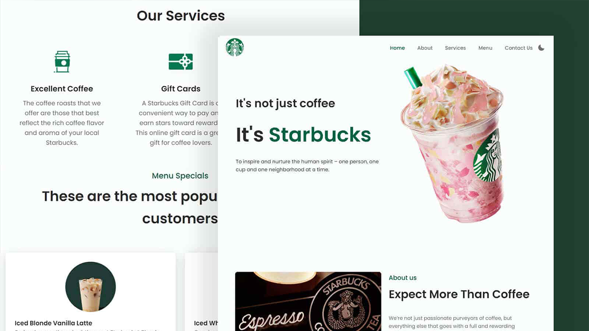

# Responsive StarBucks Redesign Website
## [See Live Preview](https://starbucks-redesigned-demo.netlify.app/)
### Responsive StarBucks Redesign Website

- Starbucks Redesign built using HTML, CSS & JAVASCRIPT.
- Contains animations when scrolling.
- Includes a dark and light mode.
- Developed first with the Mobile First methodology, then for desktop.
- Compatible with all mobile devices and with a beautiful and pleasant user interface.

I don't own the photos used in this site. Starbucks Coffee Company has all images right reserved

Swiper JS https://swiperjs.com/ and Scroll Reveal https://scrollrevealjs.org/ API used with Box Icons https://boxicons.com/ 
